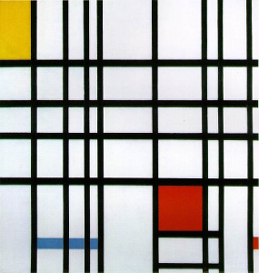
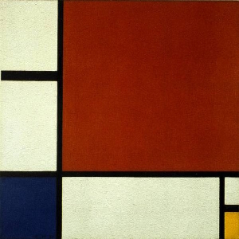
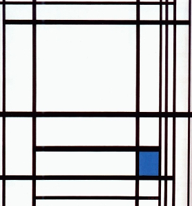
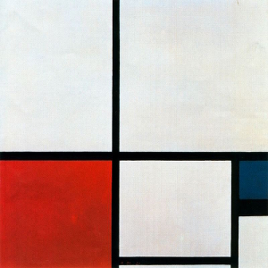
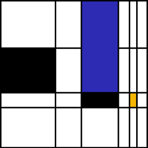
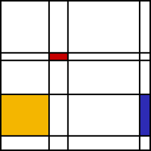
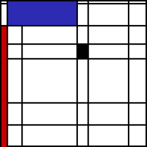
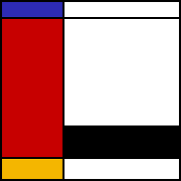

# Mondrian Generator

Random Composition in Red, Blue, and Yellow in the style of Piet Mondrian

**[Try it out online ☞ Mondrian Generator](http://jefworks.github.io/mondrian-generator/)**

Piet Mondrian was a Dutch painter best know for his involvement in the artistic movement De Stijl or neoplasticism. De Stijl consisted of a white background, upon which Mondrian painted a grid of vertical and horizontal black lines and the three primary colors such as red, blue, and yellow. Some notible work by Mondrian include:

 

For more information, please see: http://www.piet-mondrian.org/

The scripts provided here generate random compositions in red, blue, and yellow in the style of Mondrian. Scripts were originally developed in R and later in Javascript. Scripts were developed as part of an Introduction to Computer Science for 5th to 8th grade girls class I'm putting together and teaching in order to show students how computer science can be used in, other perhaps less obvious and conventional, ways that are only limited by your imagination. 

Sample random compositions generated using the online Mondrian Generator:

## Contributing
I welcome any bug reports, enhancement requests, and other contributions. To submit a bug report or enhancement request, please use the GitHub issues tracker. For more substantial contributions, please fork this repo, push your changes to your fork, and submit a pull request with a good commit message. 

## License
I have dedicated the work to the [public domain](LICENSE).

## Other Mondrian generators online:
- http://jordanjwatkins.com/mondrian/ [source code](https://github.com/jordanjwatkins/mondrian-generator)
- http://www.tristesse.com/~howie/Flash/MondRect.html
- http://www.stephen.com/mondrimat/
- http://vart.institute/mondrian/
- http://www.isloyhere.com/mondriaan.php
